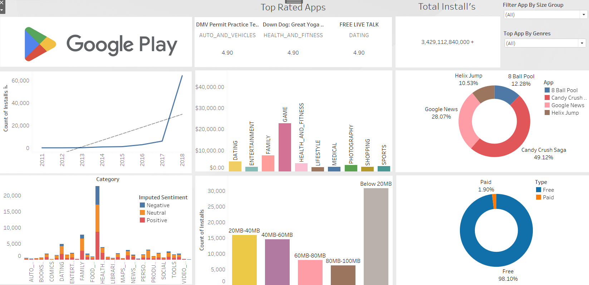

# Google Play Store Apps Interactive Dashboard

This interactive Tableau dashboard visualizes key insights from Google Play Store app data. It allows users to explore various metrics, including install counts, top-rated apps, app categories, sentiments, app sizes, and distribution of free versus paid apps.

## Key Features

### 1. **Install Growth Over Time**  
- Displays the trend of app installations from 2011 to 2018.
- Sharp growth in installs, especially after 2016.

### 2. **Top-Rated Apps**
- Highlights the top 3 highest-rated apps:
  - DMV Permit Practice Test (Auto and Vehicles): 4.90
  - Down Dog: Great Yoga (Health and Fitness): 4.90
  - Free Live Talk (Dating): 4.90

### 3. **Category-Wise Revenue**
- Shows revenue generated by various app categories.
  - Games have the highest revenue, followed by Family and Health & Fitness apps.

### 4. **Imputed Sentiment Analysis by Category**
- Sentiment analysis (Positive, Neutral, Negative) visualized for each category.
  - Health, Games, and Entertainment apps receive high levels of engagement.

### 5. **App Size Distribution**
- Bar chart showing installs based on app size.
  - Apps below 20MB have the most installs, while larger apps see fewer installs.

### 6. **Popular Apps by Market Share**
- Donut chart representing market share of popular apps.
  - Candy Crush Saga dominates with 49.12%, followed by Google News and 8 Ball Pool.

### 7. **Free vs Paid Apps**
- Visualizes the percentage of free vs paid apps.
  - A large majority (98.10%) of apps are free, with 1.90% being paid.

## Interactive Visualizations
- **Filter by App Size Group**: Allows users to filter the dashboard by app size, giving a more detailed look at installs across size categories.
- **Filter by Genre**: Users can interactively explore top apps by genre.

## Data Cleaning and Calculations
Several calculated fields were created, and extensive data cleaning was performed in Tableau, including:

1. **Data Cleaning**:
   - Addressed missing values and removed outliers.
   - Filtered data for key metrics (installs, ratings, sentiments).

2. **Calculated Fields**:
   - **Imputed Sentiment**: Reviews were categorized as Positive, Neutral, or Negative.
   - **Revenue per Category**: Total revenue generated by each app category.
   - **Market Share**: Install percentage for popular apps.
   - **Install Growth Rate**: Year-over-year growth in app installs.

## How to Use
This dashboard is designed for:
- **App Developers**: Analyze trends in app categories, user sentiments, and popular app sizes.
- **Business Analysts**: Explore install growth, revenue patterns, and market share insights.
- **Marketing Teams**: Focus on high-performing categories and app types for campaigns.

## Requirements
- **Tableau Desktop** for creating or interacting with the dashboard.
- **Google Play Store Dataset** to load app-related data.

